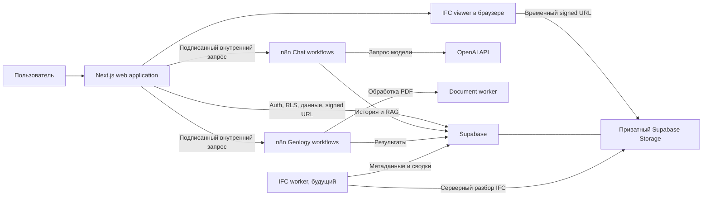

# Архитектура UstaBIM Tools

Документ фиксирует предварительные границы компонентов. Он не означает, что компоненты уже реализованы.

## Общая схема

Ключевой принцип: **браузер не должен напрямую вызывать приватные webhook n8n**. Web-приложение проверяет сессию и права, формирует доверенный контекст пользователя и подписывает внутренний запрос. n8n повторно проверяет подпись и не доверяет идентификаторам из тела браузерного запроса.

Исключение для публичной границы — Supabase Auth: браузер вызывает его через официальный SDK с публичным anon/publishable key для входа, выхода и запроса recovery-письма. Пароль не проходит через API UstaBIM Tools. Recovery code обменивается серверным callback на cookie-сессию и допускает переход только на фиксированный `/reset-password`. Public key не даёт административных прав и не заменяет обязательные RLS-политики; service role key никогда не попадает в браузер.

## Компоненты и ответственность

### Web application

Будущее Next.js-приложение отвечает за:

- пользовательский интерфейс и серверные HTTP API;
- авторизацию через проверенную сессию Supabase;
- управление проектами и файлами;
- интерфейсы IFC-просмотрщика, калькуляторов, чата и анализа геологии;
- проверку доступа к ресурсу перед любым внутренним вызовом;
- проксирование и подпись запросов к n8n;
- безопасное преобразование внутренних ошибок в публичные ответы.

Web application не выполняет workflow ИИ и тяжёлую обработку документов.

### Supabase

Supabase отвечает за email-аутентификацию, Google OAuth, PostgreSQL, Row Level Security, приватный Storage и pgvector. Здесь планируется хранить профили, проекты, метаданные файлов, историю чатов, результаты расчётов и анализа геологии. PostgreSQL является источником истины для прав доступа и состояний задач; Storage — для исходных и производных файлов.

### n8n Chat workflows

Workflow чата обрабатывают сообщения, вызывают языковую модель, ведут память диалога, выполняют RAG, вызывают только разрешённые инструменты, учитывают использование моделей и нормализуют ошибки ИИ. Они не управляют пользователями, проектами или правами доступа.

### n8n Geology workflows

Workflow геологии запускают и оркестрируют анализ, управляют его этапами, вызывают document-worker, извлекают и валидируют структурированные геологические данные, сохраняют результат и формируют предварительное резюме. Статус задания записывается в PostgreSQL после значимых переходов.

### Document worker

Будущий изолированный FastAPI-сервис получает авторизованную ссылку или поток PDF, извлекает текст с разбивкой по страницам и таблицы, применяет OCR только к требующим этого страницам и возвращает n8n структурированный результат. Предполагаемые библиотеки: Docling, PyMuPDF и PaddleOCR. Worker не принимает решения о правах пользователя и не формирует окончательные инженерные выводы.

### IFC worker

Будущий Python-компонент на IfcOpenShell выполняет серверную проверку IFC, извлекает структуру и свойства, готовит сводную информацию для ИИ и вычисляет количественные показатели. Крупная геометрия остаётся в файловом хранилище, а не в PostgreSQL.

### IFC viewer

Браузерный viewer на That Open Components и web-ifc загружает IFC по краткоживущему signed URL и предоставляет отображение модели, выбор элементов, свойства, дерево модели, скрытие, изоляцию, измерения и секущие плоскости. Viewer не обходит RLS и не хранит сервисные ключи.

## Границы взаимодействия

- Прикладные запросы клиент отправляет только web application; сервер выводит пользователя из проверенной сессии.
- Для email-входа клиент обращается к публичному Supabase Auth API; Next.js proxy обновляет cookie, а защищённые server layouts проверяют claims повторно.
- Доступ к проекту и файлу проверяется до выдачи signed URL и до запуска дорогой операции.
- Web application и n8n взаимодействуют по подписанным запросам с ограниченным временем действия и защитой от повторного воспроизведения.
- n8n вызывает workers по внутреннему адресу с отдельным секретом и ограниченным контрактом.
- Результаты фоновых операций сохраняются идемпотентно; база данных остаётся источником текущего статуса.
- Redis предназначен для очередей, блокировок и краткоживущего состояния, но не для постоянного хранения результатов.
