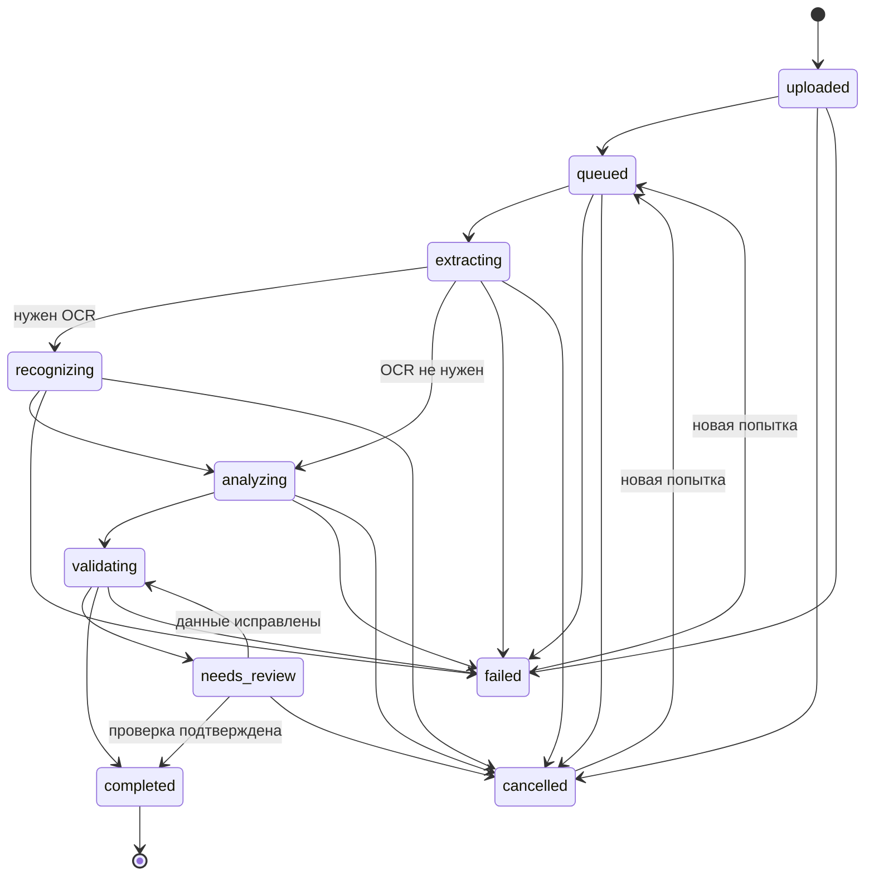

# Статусы фоновых операций

Статус меняется только доверенным серверным компонентом. Повторный запрос запуска должен возвращать существующую операцию при том же ключе идемпотентности либо создавать новую попытку, явно связанную с предыдущей; он не должен молча переводить конечную запись назад.

## Файл

| Статус | Значение | Допустимые переходы |
|---|---|---|
| `uploading` | Запись создана, загрузка ещё не подтверждена | `uploaded`, `failed`, `deleted` |
| `uploaded` | Объект подтверждён в приватном Storage | `processing`, `ready`, `failed`, `deleted` |
| `processing` | Выполняется проверка или подготовка | `ready`, `failed`, `deleted` |
| `ready` | Файл готов к использованию | `processing`, `deleted` |
| `failed` | Загрузка или обработка завершилась ошибкой | `uploading`, `processing`, `deleted` |
| `deleted` | Файл логически удалён и недоступен | нет |

`deleted` — конечное состояние. Повторная обработка создаёт новую попытку; повторная загрузка после ошибки может использовать ту же запись только до успешного подтверждения объекта.

## IFC-модель

| Статус | Значение | Допустимые переходы |
|---|---|---|
| `uploaded` | IFC сохранён, серверная обработка не начата | `processing`, `failed` |
| `processing` | IFC проверяется и разбирается | `ready`, `failed` |
| `ready` | Производные данные доступны | `processing` |
| `failed` | Попытка обработки не удалась | `processing` |

`ready` и `failed` завершают конкретную попытку. Явный повторный запуск переводит модель в `processing`, увеличивает номер попытки и не уничтожает сведения о предыдущей ошибке.

## Геологическое задание

| Статус | Значение | Допустимые переходы |
|---|---|---|
| `uploaded` | Исходный PDF подтверждён | `queued`, `cancelled`, `failed` |
| `queued` | Задание ожидает worker | `extracting`, `cancelled`, `failed` |
| `extracting` | Извлекаются страницы, текст и таблицы | `recognizing`, `analyzing`, `cancelled`, `failed` |
| `recognizing` | Выполняется OCR выбранных страниц | `analyzing`, `cancelled`, `failed` |
| `analyzing` | Формируются структурированные данные | `validating`, `cancelled`, `failed` |
| `validating` | Проверяются схема, источники и согласованность | `needs_review`, `completed`, `failed` |
| `needs_review` | Требуется ручная проверка неоднозначностей | `validating`, `completed`, `cancelled` |
| `completed` | Результат сохранён и завершён | нет |
| `failed` | Попытка завершилась контролируемой ошибкой | `queued` |
| `cancelled` | Выполнение отменено | `queued` |

`completed`, `failed` и `cancelled` завершают попытку. Повторный запуск из `failed` или `cancelled` создаёт новый номер попытки и ставит задание в `queued`; завершённый результат не перезапускается без явного нового задания.

## Сообщение чата

| Статус | Значение | Допустимые переходы |
|---|---|---|
| `pending` | Сообщение принято и ожидает обработки | `streaming`, `completed`, `failed`, `cancelled` |
| `streaming` | Ответ модели передаётся частями | `completed`, `failed`, `cancelled` |
| `completed` | Полный ответ сохранён | нет |
| `failed` | Ответ не получен или не сохранён | нет |
| `cancelled` | Генерация остановлена | нет |

`completed`, `failed`, `cancelled` — конечные. Повторная отправка создаёт новое сообщение с новым идентификатором; одинаковый ключ идемпотентности возвращает исходное сообщение.

## Запуск калькулятора

| Статус | Значение | Допустимые переходы |
|---|---|---|
| `pending` | Входные данные приняты, расчёт выполняется | `completed`, `failed` |
| `completed` | Результат и версия алгоритма сохранены | нет |
| `failed` | Расчёт завершился ошибкой | нет |

`completed` и `failed` — конечные. Повторный запуск создаёт отдельную запись, кроме повтора запроса с тем же ключом идемпотентности.
